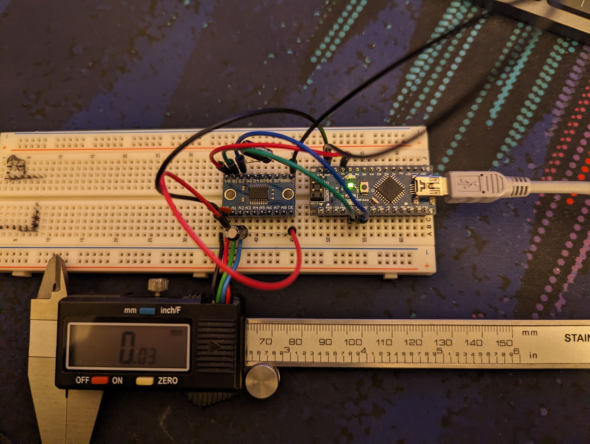
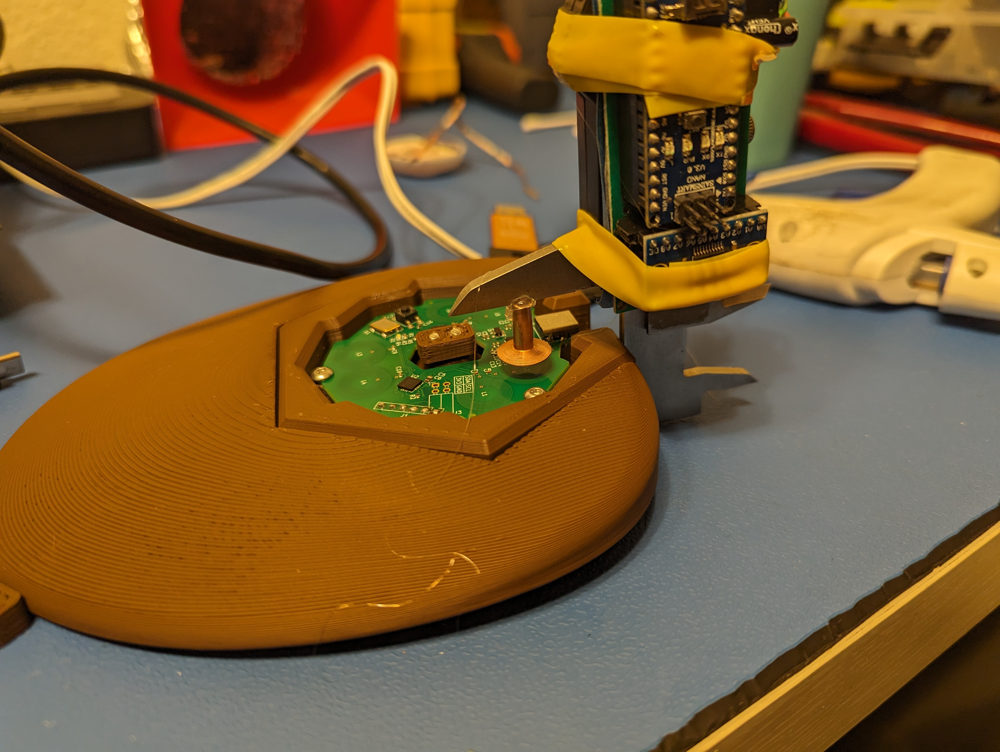
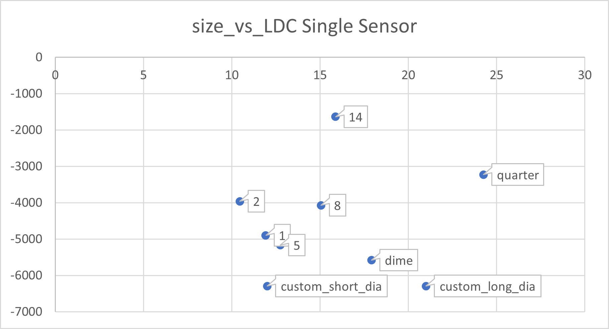
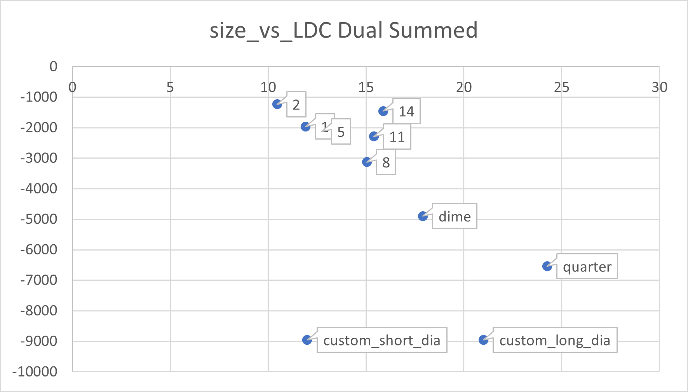
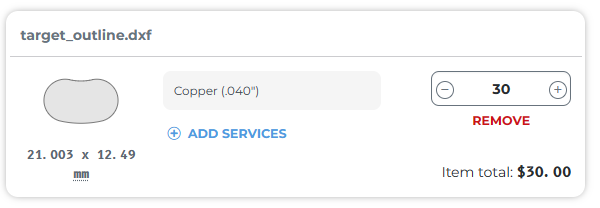

# os3m_target_testing
This repo contains resources used in testing targets and finding characteristic curves.

# Firmware Changes to Capture Raw LDC Data.

To capture raw LDC data the `sendGamepadReport` command in the `main` function needs to be changed to:

```cpp
sendGamepadReport((uint16_t)ldc1_ch1_dif, (uint16_t)ldc1_ch0_dif, 0, 0, 0, 0);
```

# Images








