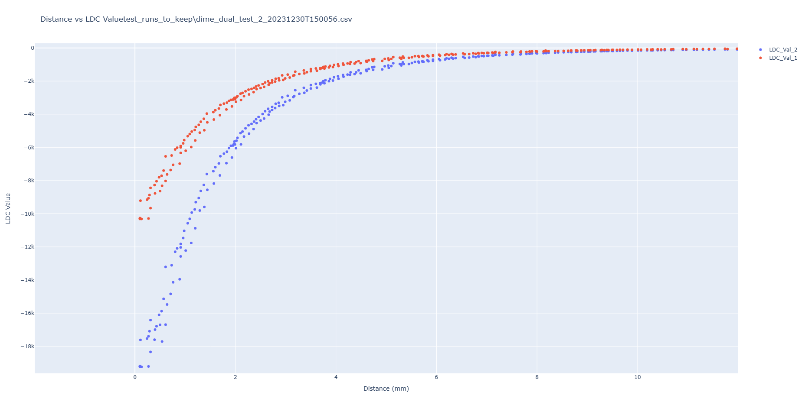
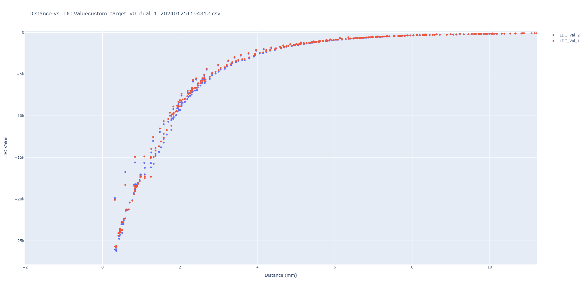
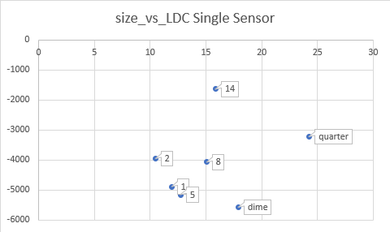
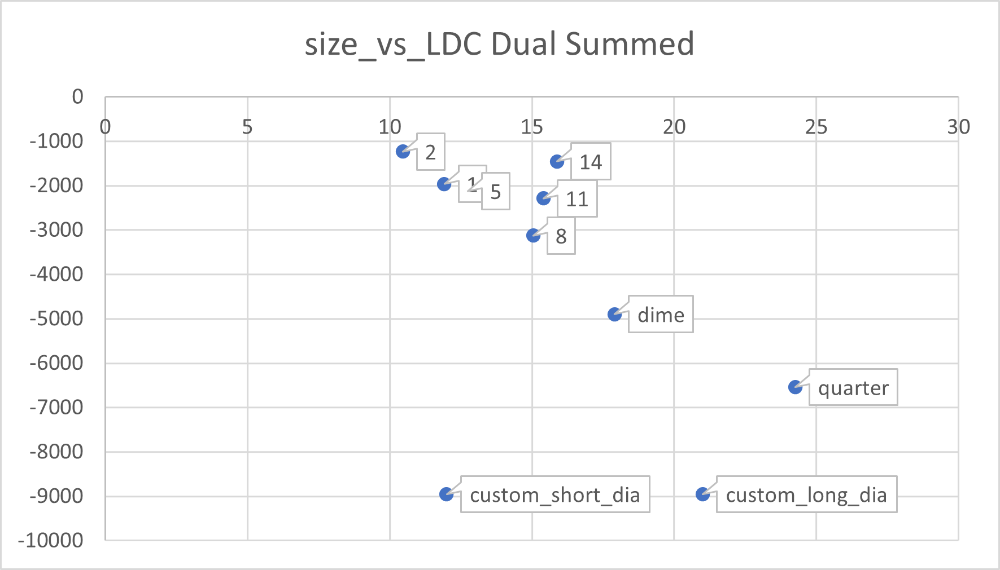
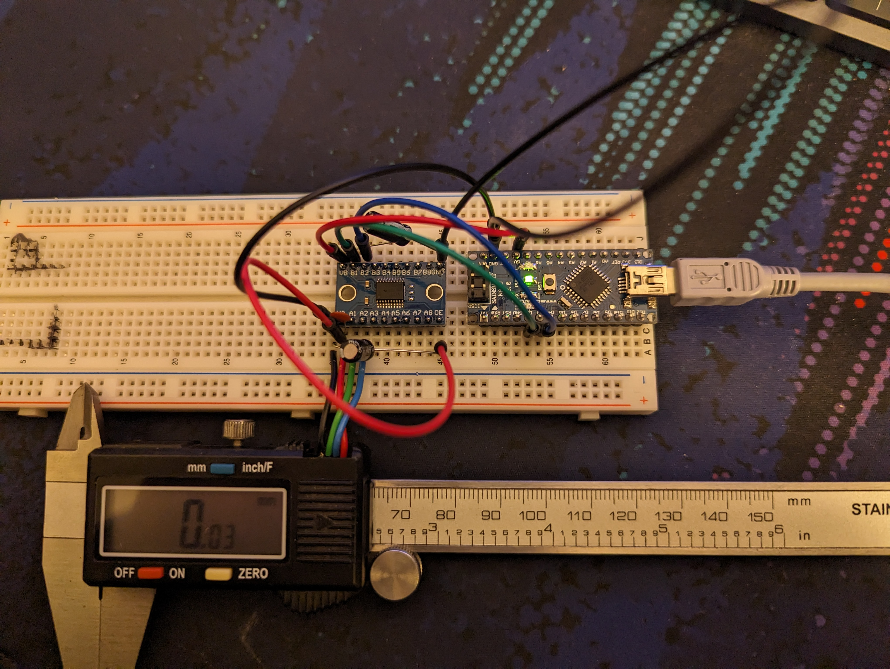
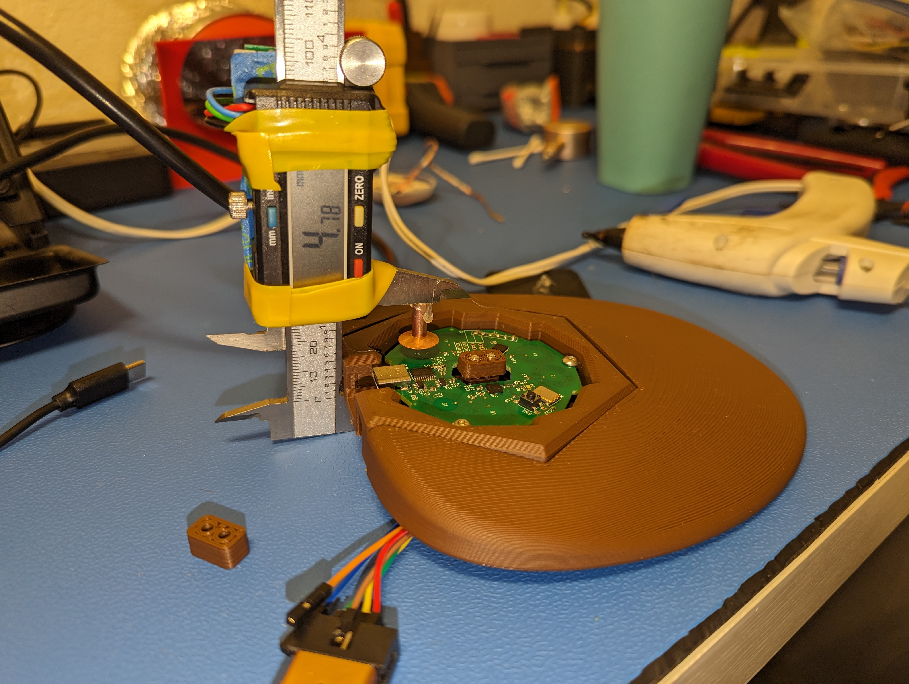
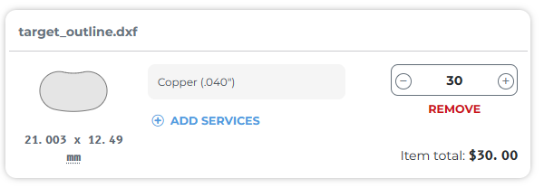
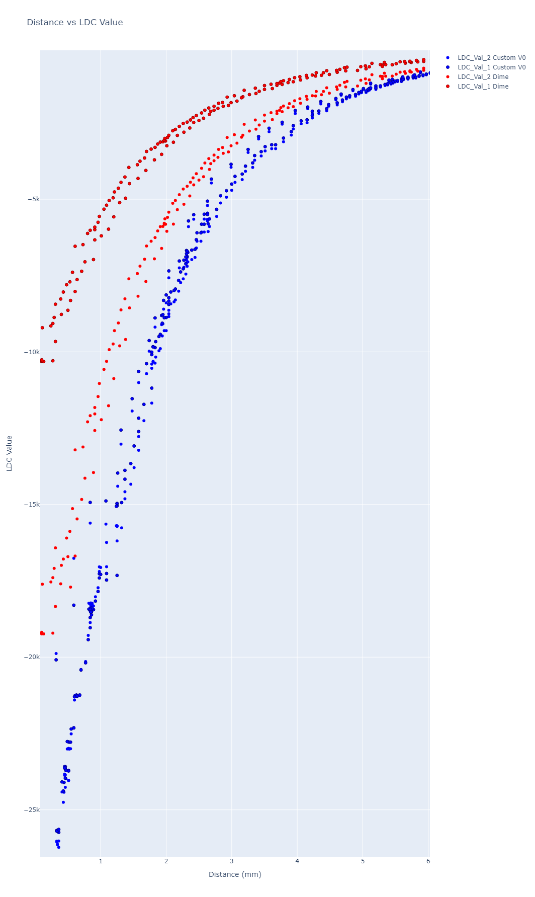
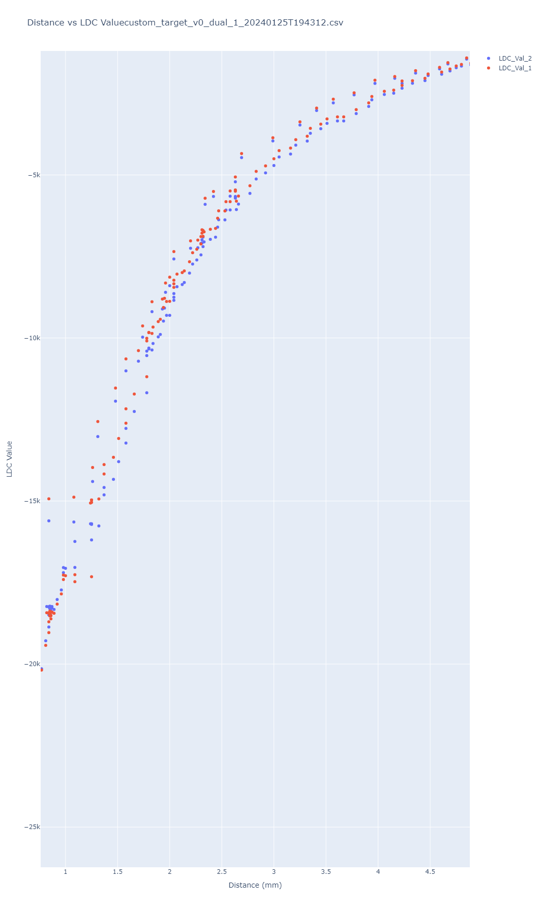

# os3m Target Testing

**Update Alert** 

I tested the custom target, and found it to be way better than all the others.

I have updated a few of the graphs in the process section of the report, but please jump to the end if you want to just see the results from the custom target.


## Overview

This repository documents the comprehensive testing process for different targets using the os3m mouse. The purpose of these tests was to identify characteristic curves for various targets and to optimize sensor readings. This document serves as a lab report detailing firmware modifications, test setups, results, and analysis.

## Firmware Modifications for Raw Data Capture

To facilitate the capture of raw LDC data, modifications were made to the firmware. The changes are specific to the `sendGamepadReport` function within the `main` function of the firmware code.

### Modified Code Snippet

```cpp
// Send the difference in LDC readings as HID gamepad inputs
sendGamepadReport((uint16_t)ldc1_ch1_dif, (uint16_t)ldc1_ch0_dif, 0, 0, 0, 0);
```

This alteration sends the differential LDC readings as inputs to the HID gamepad, with the first two channels populated and the remaining channels zeroed out.

## Experimental Setup

The experimental setup included a custom-designed measurement rig to hold the targets at specific distances from the sensor array. Data capture was automated using a platformio project on an Arduino Nano to read distances from digital calipers and a series of Python scripts to log data and generate visualizations.

### Hardware Components

- os3m sensor array with firmware modifications
- Measurement rig with adjustable target holder (hot glue)
- Digital calipers interfaced with an Arduino Nano

### Test Targets

A variety of targets were tested, including commonly found objects such as coins and specifically designed optimum targets based on hypothesized performance characteristics.


## Test Sequence

Tests were conducted by zeroing the calipers first with the target as close to the sensing element as it could go. In the case of large targets like a quarter this was just above the surface of the PCB because of collisions. 

Then the test target was pulled 40 mm away from the PCB, and the os3m was zeroed. 

The target was then slowly moved towards and way from the LDC sensing element.

Tests were conducted with the target centered over a single coil, and then between the coils L1 and L2. 

## Results and Analysis

Each test produced a set of raw data files, which were processed to generate interactive visualizations and summary statistics. The tests aimed to establish a relationship between the size, shape, and composition of the targets and the LDC sensor readings.

This testing also aimed to find the characteristic curves of the LDC readings vs distance. 

### Data Visualization

The test results were visualized using Plotly graphs, which illustrate the relationship between the target distance and LDC sensor output. Two sensor configurations were tested: single and dual LDC setups.






Graphs of this data were generated using `plotly` and can be found in: `data_capture/test_runs_to_keep`

You will probably have to download and open the HTML files locally for their interactive elements to work. 

### Test Setup Images

The following images showcase the measurement rigs and the array of test targets:


Used to prototype the circuit for reading data from the calipers.




## Repository Structure

- `caliper_reader`: Contains the platformio project and test scripts for the Arduino Nano used in data acquisition from the digital calipers.
- `data_capture`: Includes the Python scripts for data logging and analysis, as well as the raw CSV data files and generated HTML files with interactive graphs.
- `hypothesized_optimum_target`: Features the design files for the proposed optimum target based on testing insights.

## Designing an Optimum Target

The testing process has successfully characterized the response of the os3m system to various targets, providing valuable data to inform the design of an optimized target. 

For next steps I have designed and ordered what I hypothesize to be the optimum target shape. 



This design should allow the mouse to not be dependent on US currency for the target shape, and optimize the target response to be at a good sensing strength.

Its main design considerations are:
- Cover most but not all of both coils when in between them. 
- Fit within the mouse coil volume, so it can have a zero reference point of the board's surface. 
- Be made of a high conductivity material for good inductive response.
- Have enough thickness so no induction field is lost.

## Custom Target v0 Testing

The custom target was brought through a similar testing procedure as to all the other targets except:
I left out the static tests because in analysis I only ended up using the
strength @3mm, and I can just pull that from the dynamic test. 

They ended up preforming really well compared to the other targets. See
[Data Visualization](#data-visualization)

Their coverage of both coils made them less sensitive to off center placement, as it meant they could spend most of their distance out of the highly exponential region of the LDC sensor. 

Additionally they stand out for their diameter vs reading strength @3mm. Even measuring its largest dimension it stands well below the trend line. This extra sensitivity should allow the target greater dynamic range, or more linear operation depending on how it is configured relative to the sensors. 



These two performance characteristics combined allow the custom target to have almost double sensitivity of a dime, and balance the inputs between LDC coils when centred better. 

### Recommended Operating Region



To optimally use this target flexures should be designed to have it nominally sit `2.5 mm` above the board for a center LDC value of `~6000`. Minimum and maximum travel should be: `0.7 mm` and `4.8 mm`. This places the sensing dynamics over a mostly linear region, and should allow some margin for rotation dynamics. 

To explore the data yourself download and open this `.html` file:

[Custom Target HTML Graph](./custom_target_v0/custom_target_v0_dual_1_20240125T194312_dist_vs_ldc.html)

### Conclusion

This target will be a major step forward for the capability of the system. 

The data collected could be used to add a linearization system to the code. 

Future work could include characterizing how this target changes response at angles. 

## Licensing

The resources in this repository are provided under the terms outlined in the [LICENSE](LICENSE) file.
